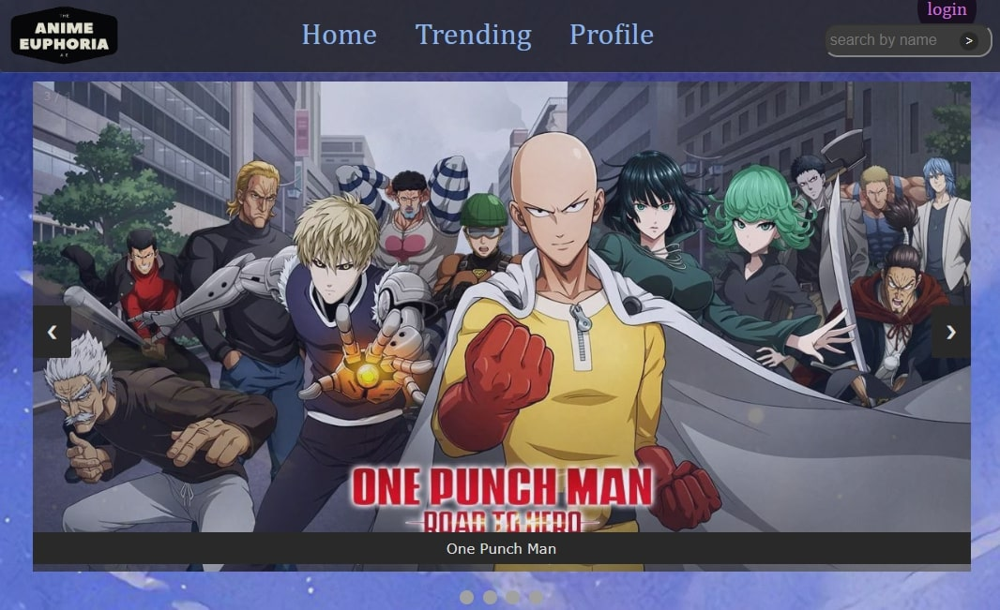
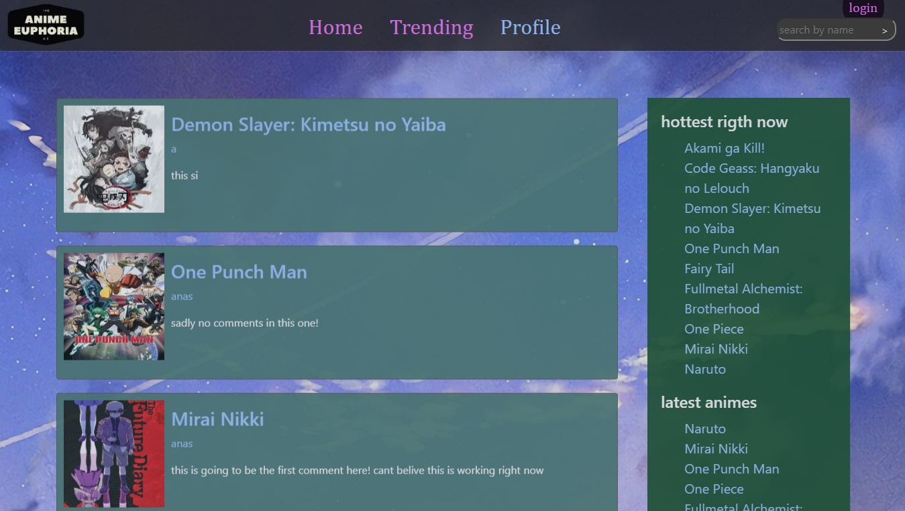
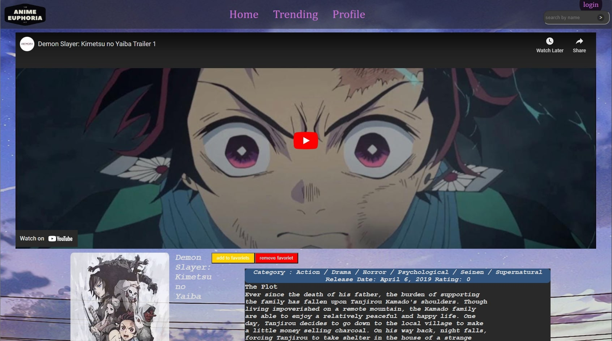
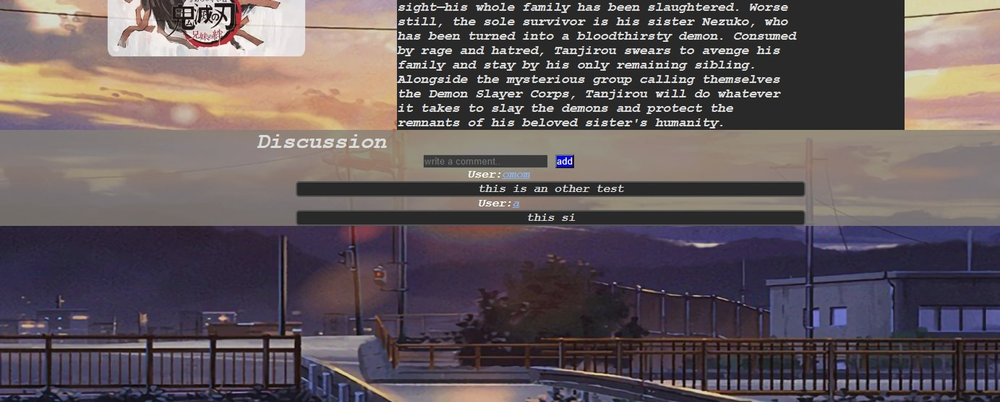
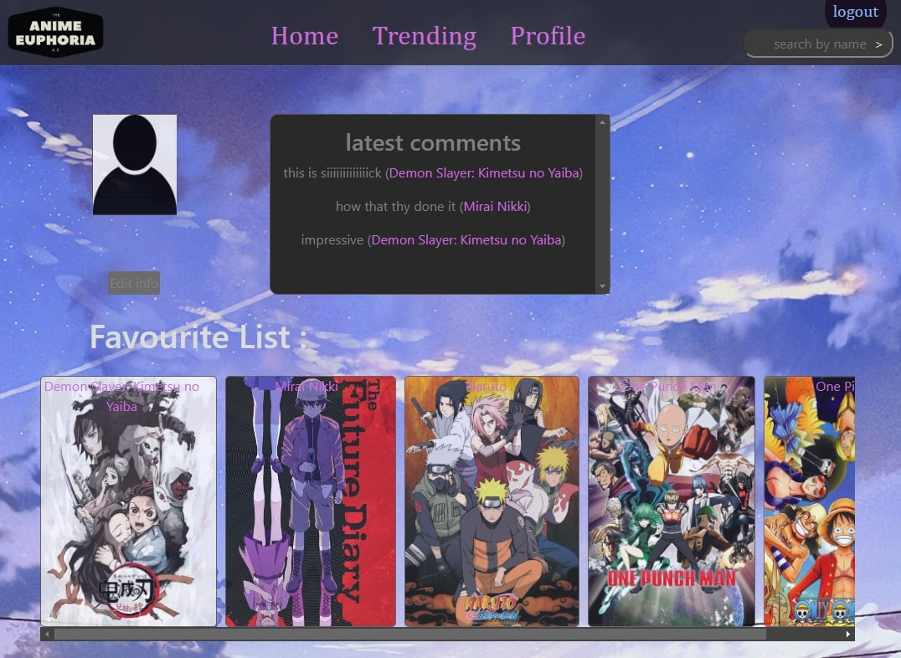
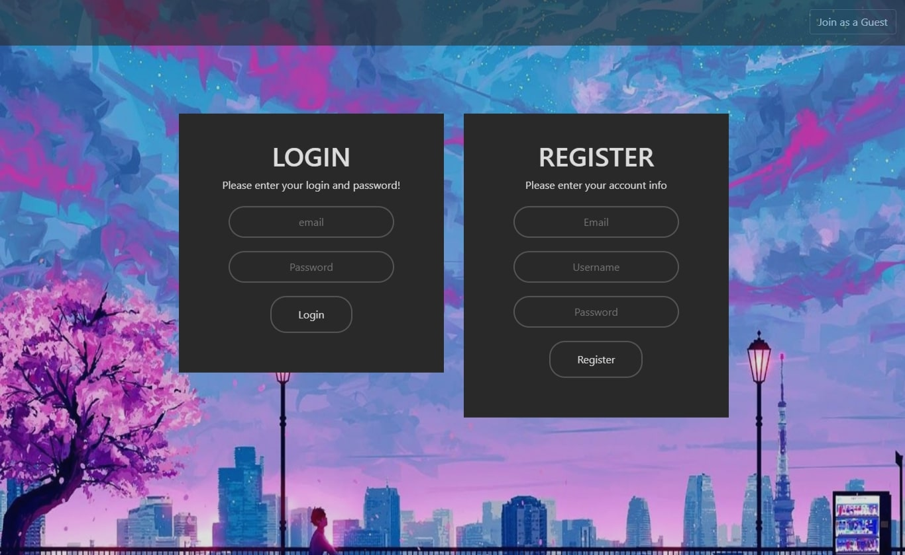

<p align="center">
	
</p>
<h1 align="center">
  Anime Discovery app
</h1>

<p align="center">
   
</p>

<p align="center">

</p>
<p align="center">
    <a href="https://memberpress.com/wp-content/uploads/2020/12/coming-soon-page.jpg" target="blank">View Demo</a>
    ·
    <a href="https://github.com/OmarMHawash/userpanel/issues/new">Report Bug</a>
    ·
    <a href="https://github.com/OmarMHawash/userpanel/issues/new">Request Feature</a>
</p>

#### Welcome to Anime Euphoria!

Our web app helps you to discover animes and discuss with other users about each anime series

<h2 id="demo"> 🚀 Demo </h2>


Checkout The Demo: [Live Demo](https://memberpress.com/wp-content/uploads/2020/12/coming-soon-page.jpg)

<h2 id="markdown-navigation"> 🧭 Markdown Navigation </h2>

- [Markdown Navigation](#markdown-navigation)
  - [Quick Start](#quick-start)
  - [Features](#features)
  - [Resources](#resources)
  - [Preview](#preview)
  - [What's New?](#changes)

<h2 id="quick-start">🛠️ Installation Steps </h2>

### \*pre-requisites

- have **Python** (3.8 or newer) with **Pip** plugin correctly installed on your machine.
- **Django** installed in a virtual python enviroment and all set-up.

## Steps

1. Clone or download the repository

```bash
git clone https://github.com/OmarMHawash/HollyLand
```

2. run the `activate` script in your venv folder

3. Run the app with `py manage.py runserver`

<h2 id="features">🤯 Features & Functionalities </h2>

- Explore Popular animes with simple homepage design & Searching our library.
- checkout what's trending and people currently discussing.
- Profile page with favorite selected animes and info
  ...

<h2 id="preview">🌁 Project showdown </h2>

### Home Page

<p align="center">
	
</p>

### Trending Page

<p align="center">
	
</p>

## Anime Page

<p align="center">
	
</p>

## Anime Discussion

<p align="center">
	
</p>

## User Profile

<p align="center">
	
</p>

## Login

<p align="center">
	
</p>

<h2 id="changes"> 🆕 What's New </h2>

### Latest Features

- ...

### Changelog

- ...
- ...
